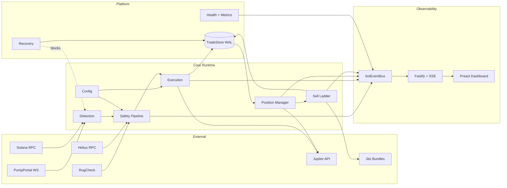
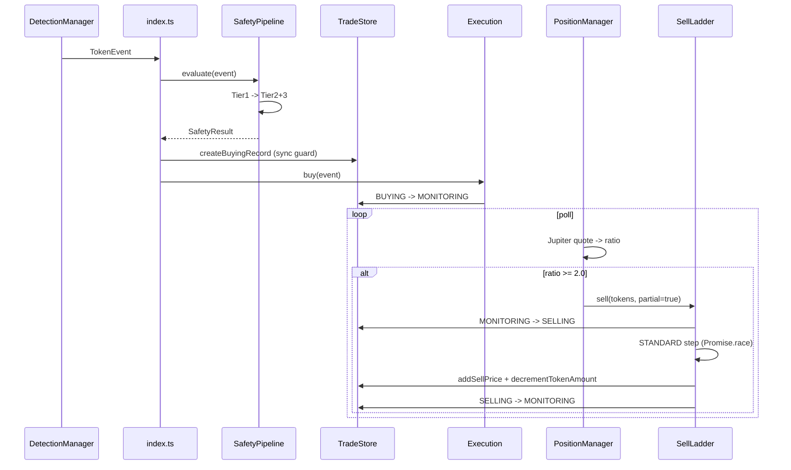

# SolSniper

Autonomous Solana token-sniping bot with real-time three-tier safety filtering and a six-step graduated sell-escalation ladder.

## Overview

SolSniper detects brand-new SPL token launches on Solana — pump.fun bonding-curve mints, Raydium V4 pools, and PumpSwap pools — runs each candidate through an eight-check safety pipeline in real time, executes first-block buy transactions on those that pass, and manages open positions through configurable exit triggers. On exit it escalates through six progressively more aggressive sell strategies ending at 49% slippage with Jito MEV bundles.

Target operator: a solo or small-team algorithmic trader running the bot on a personal server. The core engineering tension is reconciling *speed* (landing buys in the first block after detection) with *safety* (filtering rug pulls, honeypots, and impersonation scams before capital is committed).

## Key Features

- **Token Detection** — PumpPortal WebSocket for pump.fun new-token events; single `onLogs` subscription covering Raydium V4 and PumpSwap; mint-level deduplication; pre-filter for length bounds, spam keywords, and 11 impersonation targets.
- **Three-Tier Safety Pipeline (8 checks)** — Tier 1 hard blocks (`Promise.all`): `authority`, `sell-route`, `liquidity`. Tier 2 scoring (`Promise.allSettled`): `rugcheck`, `holder`, `lp-lock`, `metadata`. Tier 3: `creator-history` with serial-deployer detection and persistent blocklist.
- **Dynamic Fee Estimation** — Helius `getPriorityFeeEstimate` with 5s TTL cache and per-API circuit breaker (30s cooldown after 5 consecutive failures).
- **Buy Execution** — Dual-path routing (PumpPortal trade-local for pump.fun, Jupiter for Raydium/PumpSwap), blockhash-last signing, parallel broadcast across all RPC connections, write-ahead `BUYING` row before any on-chain action.
- **Sell Escalation Ladder** — Six time-bounded steps in fixed order: `STANDARD → HIGH_FEE → JITO_BUNDLE → CHUNKED → PUMPPORTAL → EMERGENCY`. `EMERGENCY` fires at 49% slippage with 10× priority fee.
- **Position Management** — Recursive `setTimeout` polling evaluates tiered take-profit (2×/5×/10× at 33/33/34 by default), trailing stop, stop-loss, max hold. Stretches poll interval by `JupiterClient.cooldownRemainingMs()` during rate-limits.
- **Dashboard & Controls** — Fastify 5 on `127.0.0.1`, seven REST routes, SSE stream with 14 typed event types. Pause/resume detection, force-sell by trade ID, emergency-stop (requires typing "STOP").
- **Crash Recovery** — `RecoveryManager` reconciles in-flight trades against wallet state at startup and blocks `DetectionManager.start()` until done.

## Technical Highlights

- **Synchronous duplicate-buy guard** — `TradeStore` exploits synchronous `better-sqlite3` so the `activeMints` Set check, the `INSERT`, and `activeMints.add` all execute in one call-stack frame with no `await`. No concurrent token event can slip through.
- **Write-ahead BUYING persistence** — The `BUYING` row is written before any on-chain action. On crash mid-buy, recovery checks wallet balance to decide `MONITORING` vs `FAILED`.
- **RugCheck tuple return** — `checkRugCheck` returns `[CheckResult, RugCheckResultData | null]` so the orchestrator can reuse RugCheck's `lpLockedPct` to override the on-chain LP-lock result — one API call, two signals.
- **Module-level monitoring injection** — Seven fetch-calling modules expose a `setXxxMonitoring(...)` setter called once from `src/index.ts`, avoiding deep constructor threading while keeping every API surface observable.
- **Token-2022 single-query balance** — `getParsedTokenAccountsByOwner(wallet, { mint })` without a `programId` filter searches both token programs in one call; a previous dual-query approach double-counted and produced Jupiter error 6024.
- **Three-layer config validation with rollback** — `POST /api/config` validates shape, then full `TradingConfigSchema`, then `validateSemantics()`. A `structuredClone` snapshot is taken before patching so rollback does not alias nested references.

## Architecture Overview

Eight major subsystems, initialized in strict dependency order in `src/index.ts`:



Order: **Config → Detection → Safety → Execution → Position → Persistence → Recovery → Dashboard → Monitoring.** `RecoveryManager.run()` is blocking; detection does not start until reconciliation completes.

## Tech Stack

| Layer | Technology | Version |
| --- | --- | --- |
| Language | TypeScript (ES2022, strict, ESM) | 5.9.3 |
| Runtime / package manager | Node.js 16+ / pnpm | 10.14.0 |
| Test framework | Vitest | 4.0.18 |
| Database | better-sqlite3 (WAL) | 12.6.2 |
| HTTP server | Fastify + @fastify/sse + @fastify/static | 5.8.4 |
| Solana SDK | @solana/web3.js + @solana/spl-token | 1.98.4 / 0.4.14 |
| Config validation | Zod | 4.3.6 |
| Logging | pino + pino-roll | 10.3.1 / 4.0.0 |
| Dashboard | Preact + @preact/signals + Vite | 10.28.4 / 2.8.1 / 7.3.1 |
| WebSocket / event bus | ws / eventemitter3 | 8.19.0 / 5.0.4 |

External services: PumpPortal WebSocket, Jupiter Swap API v1, Helius RPC (priority-fee + DAS), RugCheck, Jito block engine.

## Feature Deep Dive

### Detection (`src/detection/`)

`DetectionManager` orchestrates a `PumpPortalListener` (extends `ResilientWebSocket` in `src/core/resilient-ws.ts` — exponential backoff 3s→60s, 30s heartbeat, excessive-reconnect alerting) and a `RaydiumListener` that installs one `onLogs` subscription covering both Raydium V4 and PumpSwap. A silence-based health-check recreates the subscription after 2 minutes without events.

### Safety Pipeline (`src/safety/`)

`src/safety/safety-pipeline.ts` handles four exit paths — Tier 1 reject, soft block, score reject, pass — and emits a `SAFETY_EVALUATION` SSE event on every non-cached evaluation.

- **Tier 1 (parallel):** `authority` (program detection via `info.owner`), `sell-route` (Jupiter quote, skipped for pumpportal source), `liquidity` (bonding-curve PDA with IDL-discriminator validation for pump.fun; pool quote-vault SOL for Raydium).
- **Tier 2 (`Promise.allSettled`):** `rugcheck`, `holder` (top-1 > 25% or top-10 > 50% = soft block), `lp-lock` (UNCX + incinerator, overridable by RugCheck), `metadata` (Metaplex PDA `isMutable` penalty).
- **Tier 3:** `creator-history` via Helius DAS with serial-deployer heuristic (0–1 mints = 80, 2–3 = 50, 4–9 = 20, ≥10 = hard reject with auto-blocklist).

Aggregate scoring is a weighted average with flat penalties for LP-lock failure and mutable metadata (`src/safety/safety-pipeline.ts:186`). Tier 2/3 errors degrade to `score=0, pass=true` — a pessimistic score that reduces the aggregate without blocking. Only `holder` and `creator` soft-block on `pass=false`, so API outages cannot globally halt trading.

### Execution (`src/execution/`)

`ExecutionEngine` routes buys by `event.source`. `broadcastAndConfirm` in `src/execution/broadcaster.ts` fetches the latest blockhash immediately before `tx.sign(...)` and broadcasts via `sendRawTransaction` to every RPC connection in parallel. The retry wrapper calls `getSignatureStatuses` between retries to detect late-landing transactions.

### Sell Ladder (`src/execution/sell/sell-ladder.ts`)

Six time-bounded steps in fixed order. The ladder advances on timeout regardless of the underlying error:

| Step | Slippage | Priority fee | Timeout |
| --- | --- | --- | --- |
| STANDARD | 1000 bps | 1× | 30s |
| HIGH_FEE | 1000 bps | 3× | 20s |
| JITO_BUNDLE | — | tip 100 000 lamports | 30s |
| CHUNKED | per-tranche | — | 60s (3 tranches) |
| PUMPPORTAL | — | — | gated on source + `JupiterRouteError` |
| EMERGENCY | 4900 bps (49%) | 10× | 30s |

```typescript
// src/execution/sell/sell-ladder.ts:186
for (const step of steps) {
  let stepSucceeded = false;
  try {
    const result = await Promise.race([
      step.fn(),
      new Promise<never>((_, reject) =>
        setTimeout(() => reject(new Error(`Step ${step.name} timed out after ${step.timeoutMs}ms`)), step.timeoutMs)
      ),
    ]);
    stepSucceeded = 'confirmedTranches' in result
      ? (result as ChunkedSellOutcome).confirmedTranches > 0
      : true;
  } catch (err) {
    lastError = err;  // captured for PUMPPORTAL gate condition
  }
  if (stepSucceeded) { /* transition and return */ return; }
}
```

Before each run the ladder re-queries the on-chain token balance via `getParsedTokenAccountsByOwner(wallet, { mint })` rather than trusting the DB value. Partial sells transition `SELLING → MONITORING` and use a SQL `COALESCE + delta` pattern in `addSellPrice()` so accumulated proceeds survive a crash mid-ladder.

### Position Management (`src/position/position-manager.ts`)

Recursive `setTimeout` polling (default 4s) evaluates every `MONITORING` trade in priority order — tiered TP, trailing stop, stop-loss, max hold. `calcTieredTpTokens` uses `bigint` to avoid `Number.MAX_SAFE_INTEGER` overflow on high-decimal tokens.

### Dashboard (`src/dashboard/`)

Fastify 5 on `127.0.0.1:$DASHBOARD_PORT` serving a pre-built Preact SPA and seven routes (`alerts`, `config`, `controls`, `events`, `health`, `metrics`, `trades`). The typed `BotEventType` union in `src/dashboard/bot-event-bus.ts` enumerates fourteen events: `TOKEN_DETECTED`, `BUY_SENT`, `BUY_CONFIRMED`, `BUY_FAILED`, `SELL_TRIGGERED`, `SELL_PARTIAL`, `SELL_CONFIRMED`, `SELL_FAILED`, `ERROR`, `CONFIG_CHANGED`, `LOW_BALANCE`, `SYSTEM_ALERT`, and `SAFETY_EVALUATION`. The SPA exposes six views — LiveFeed, Performance, Pipeline, Controls, SystemStatus, Settings — backed by Preact signals.

## End-to-End Snipe Flow

Happy path from detection through a partial 2× take-profit exit:



Every `botEventBus.emit(...)` is fanned out to SSE clients via `src/dashboard/routes/events.ts`.

## Data / Domain Model

Persistence is a single SQLite file in WAL mode (disabled only for `:memory:` tests, which SQLite silently reverts from WAL). All statements are pre-compiled at `TradeStore` construction; an in-memory `Set<string>` backs O(1) duplicate-guard lookups and is rebuilt from non-terminal rows at startup.

**`trades` table** — `id`, `mint`, `state`, `created_at`, `updated_at`, `buy_signature`, `sell_signature`, `amount_sol`, `amount_tokens`, `buy_price_sol`, `sell_price_sol` (accumulated via `addSellPrice()`), `error_message`, `source` (`pumpportal` | `raydium` | `pumpswap`), `token_program_id` (base58: TOKEN or TOKEN_2022), `dry_run`, `safety_score`, `safety_rejection_reasons` (JSON), `safety_checks_detail` (JSON). Indexed by `(mint, state)`.

**Trade lifecycle:** `DETECTED → BUYING → MONITORING → SELLING → COMPLETED | FAILED | ABANDONED`

All `UPDATE trades` statements include `WHERE state = @expectedState` — optimistic locking. Zero rows changed means a concurrent update won and the caller handles it. The `alerts` table stores `SYSTEM_ALERT` events (indexed by timestamp and source) for the dashboard history view. Schema evolution uses an additive-only `MIGRATION_SQL` array of `ALTER TABLE` statements, each in a try/catch that swallows `column already exists`.

The duplicate-buy guard:

```typescript
// src/persistence/trade-store.ts:205
createBuyingRecord(mint: string, source?: string, tokenProgramId?: string, dryRun = false, ...): void {
  if (this.activeMints.has(mint)) {
    throw new Error(`Duplicate buy attempt blocked for mint: ${mint}`);
  }
  this.stmtInsert.run({ mint, state: 'BUYING', now: Date.now(), /* ... */ });
  this.activeMints.add(mint);
}
```

The synchronous `better-sqlite3` API guarantees check, `INSERT`, and `activeMints.add` execute in one call-stack frame with no `await`.

## Security, Reliability & Production Considerations

- **Tiered failure semantics** — Tier 1 fail-closed; Tier 2/3 errors degrade to score 0 without blocking.
- **Duplicate-buy guard** and **write-ahead persistence** — synchronous DB + Set; `BUYING` row written before any on-chain action.
- **Optimistic locking** — every `UPDATE trades` scoped by expected state. Zero rows changed means a concurrent update won.
- **Force-sell guard** — `PositionManager.sellsInFlight` Set; controls API returns HTTP 409 on concurrent force-sell.
- **RPC failover** — primary/backup with a 3-failure threshold and 10-second recovery polling.
- **Jupiter rate-limit cooldown** — one 429 triggers a global cooldown (respects `retry-after`, default 10s); `PositionManager` stretches poll interval accordingly.
- **Per-API circuit breakers** — `FeeEstimator`, `checkRugCheck`, `checkCreatorHistory` each enter 30-second cooldown after `apiFailureThreshold` (default 5) consecutive failures.
- **Balance guard** — pre-buy SOL check with 5s TTL cache; emits `LOW_BALANCE`. Sells are never blocked.
- **Token-2022 compatibility** — program detection from `info.owner`; balance queries use `{ mint }` filter so both programs are searched in one call.
- **Secret redaction** — pino serializers strip `PRIVATE_KEY` and `SECRET`; RPC URLs have API keys masked.
- **Graceful shutdown** — 5s timeout with explicit component ordering.

**Observability endpoints.** `GET /api/health` returns a component roll-up (`detection`, `rpc`, `safety`, `execution`, `apis`) with HTTP 503 when `down`. `GET /api/metrics` reports p50/p99 latency and error rate per tracked endpoint over a 5-minute sliding window. `GET /api/alerts` paginates alert history (max 100/page). `GET /api/trades` and `GET/POST /api/config` cover trade history and runtime config.

## Project Structure

```
src/
  config/        env.ts (Zod), trading.ts (JSONC + runtime patch)
  core/          balance-guard, fee-estimator, logger, resilient-ws, rpc-manager
  detection/     detection-manager, pre-filter, pump-portal-listener, raydium-listener
  execution/     broadcaster, execution-engine, jupiter-client; buy/, sell/
  monitoring/    alert-store, health-service, metrics-tracker
  persistence/   schema.ts (SCHEMA_SQL + MIGRATION_SQL), trade-store.ts
  position/      position-manager.ts
  recovery/      recovery-manager.ts (blocks detection start)
  safety/        safety-pipeline, safety-cache, blocklist, checks/ (8)
  dashboard/     auth, bot-event-bus, dashboard-server, routes/ (7)
  index.ts       15-step startup + graceful shutdown
dashboard/       Preact SPA (separate Vite build); dist/ served by Fastify
config.jsonc     Trading parameters with inline comments
```

## Configuration & Operation

### Environment variables

All variables are validated at startup by `src/config/env.ts`; any failure calls `process.exit(1)`.

**Required:** `SOLSNIPER_RPC_URL` (primary Solana RPC), `SOLSNIPER_RPC_BACKUP_URL` (backup RPC), `SOLSNIPER_PRIVATE_KEY` (base58 wallet key, min 32 chars), `SOLSNIPER_JUPITER_API_KEY` (Jupiter `x-api-key`).

**Optional:** `NODE_ENV` (default `development`), `LOG_LEVEL` (default `debug`), `PUMPPORTAL_ENABLED` (default `true`), `RAYDIUM_ENABLED` (default `true`), `RUGCHECK_API_KEY` (enables Tier 2 RugCheck), `HELIUS_API_KEY` (enables Tier 3 creator history), `DASHBOARD_PORT` (default `3001`), `DASHBOARD_API_KEY` (enables API-key auth on dashboard routes).

### Trading configuration

`config.jsonc` holds trading parameters. A subset are runtime-patchable via `POST /api/config` with three-layer validation (shape → full schema → semantic cross-field checks). Patches apply to a shadow runtime config in memory; they do not rewrite the file.

### Scripts

```bash
pnpm start           # Build dashboard, then run bot (tsx src/index.ts)
pnpm dev             # Build dashboard, then tsx watch
pnpm test            # vitest run
pnpm typecheck       # tsc --noEmit
pnpm build:dashboard # vite build --config dashboard/vite.config.ts
pnpm lint:security   # eslint src/
```

The dashboard SPA is served from `dashboard/dist/`, which must be built with `pnpm build:dashboard` before the bot first starts. `pnpm start` and `pnpm dev` chain the build for convenience.

## Testing

Vitest 4.0.18 with 39 `.test.ts` files under `src/` covering safety (10), execution (9), sell ladder, dashboard routes (6), monitoring (3), persistence, position, recovery, detection, core utilities, and config. Common patterns: `vi.mock('../../config/env.js', ...)` to prevent `process.exit(1)` in tests; `vi.stubGlobal('fetch', mockFetch)`; `vi.useFakeTimers()` for circuit-breaker cooldowns; SQLite `:memory:` for integration tests; `_resetCircuitBreaker()` test-only exports called in `beforeEach`. A **Nyquist-validation** pattern (commit `4c32608`) asserts idempotency of control operations — pause-when-paused, force-sell-when-selling — including the HTTP 409 response from a concurrent force-sell.

## Known Limitations and Scope Notes

- **PumpSwap liquidity check is a neutral pass.** `checkLiquidityDepth` unconditionally returns `pass=true, score=100` for `source='pumpswap'` because the pool vault layout was not documented at implementation time.
- **`takeProfitPct` and `maxSlippageBps` top-level config fields are unused.** They are accepted by `POST /api/config` but exit logic uses `positionManagement.tieredTp[]` and execution uses per-step slippage values. Legacy holdovers.
- **`BalanceGuard.invalidateCache()` is never called.** After a successful buy that drains SOL, the next balance check within 5 seconds reads the stale pre-buy cached value. Low-risk given the TTL but not tight.
- **Safety threshold calibration is unvalidated.** The default `minSafetyScore: 80` was chosen without real trade data and needs empirical calibration.
- **No CI/CD pipeline.** No `.github/workflows/` directory; testing is run locally.
- **No containerization.** No Dockerfile or docker-compose — raw Node.js execution is assumed.

## Conclusion

SolSniper is a latency-sensitive real-time trading pipeline with production-minded failure handling: write-ahead persistence with crash recovery, per-API circuit breakers, RPC failover, optimistic locking, cooperative rate-budget sharing, and a six-step escalation ladder that ends at 49% slippage to guarantee exit. The observability surface is dual — structured JSON logs and typed SSE events — backed by the same event bus the bot internals emit to. It combines Solana-specific concerns (Token-2022 compatibility, bonding-curve PDA parsing, Jito MEV bundles) with platform engineering concerns (schema migration, three-layer config validation, graceful shutdown, secret redaction).
